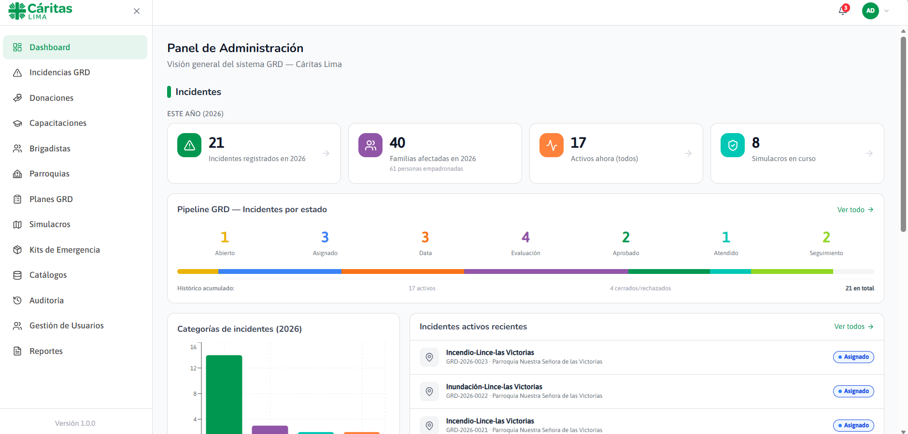
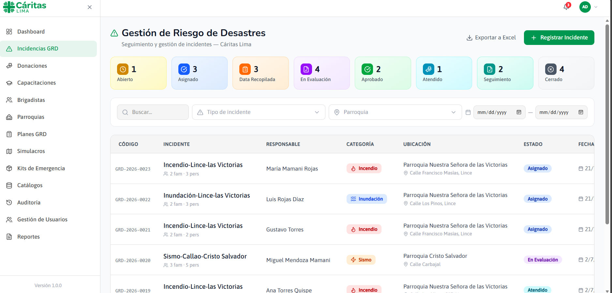
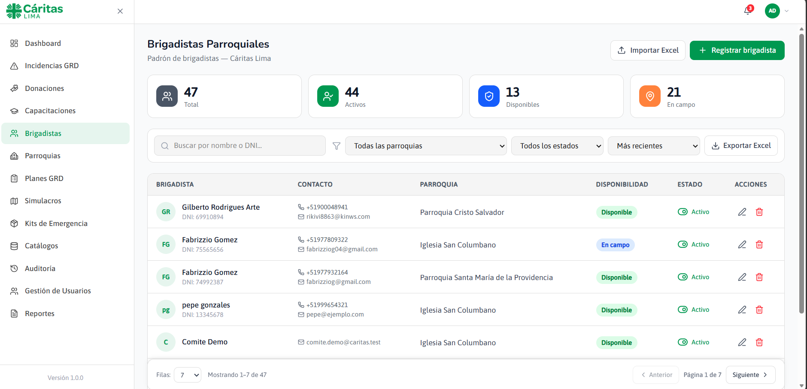
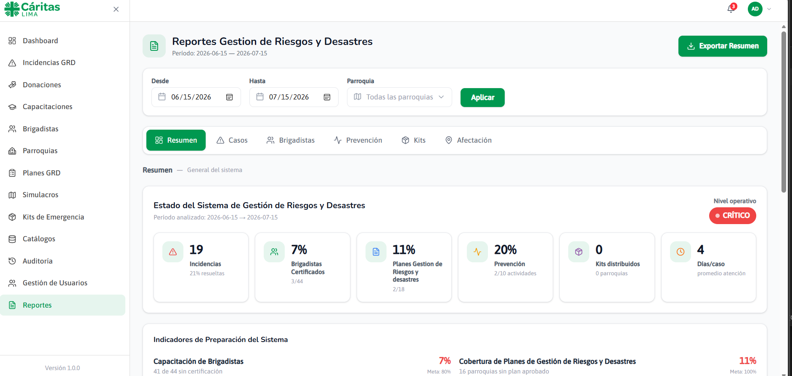

# 🌐 Caritas GRD Web Platform

> Full-stack web platform for disaster risk management, developed for **Cáritas Lima** as part of the Software Implementation Project at **Pontificia Universidad Católica del Perú (PUCP)**.

The platform acts as the central web component of the Caritas GRD information system, providing tools for managing disaster incidents, volunteers, emergency resources, training activities, humanitarian aid and operational information.

---

## Overview

The **Caritas GRD Web Platform** provides centralized management capabilities for the Unified Disaster Risk Management (GRD) system.

The platform supports administrative and operational workflows while integrating with the Android mobile application used by field volunteers.

Information collected in the mobile application can be synchronized with the central platform, allowing field operations to continue offline while maintaining centralized information management.

---

## 🖥️ Platform Demo

| Dashboard                                      | Disaster Incident Management                                  |
| ---------------------------------------------- | ------------------------------------------------------------- |
|  |  |

| Volunteer Management                                             | Reports & Data Visualization                    |
| ---------------------------------------------------------------- | ----------------------------------------------- |
|  |  |

---

## Key Features

* Secure authentication and role-based authorization
* Disaster incident registration and management
* Volunteer (brigadista) management
* Disaster drill administration
* Emergency kit and humanitarian aid management
* Training and course management
* Donation management
* Operational dashboards and reports
* Geographic visualization of disaster-related information
* Audit logging and activity traceability
* Integration with the Android mobile application
* Data synchronization between mobile and web components

---

## Technology Stack

### Frontend

* **Next.js**
* **React**
* **TypeScript**
* **Tailwind CSS**

### Backend

* **Next.js API Routes**
* **Server Actions**
* **Prisma ORM**
* **PostgreSQL**

### Authentication

* **NextAuth**
* Role-based authorization

### Cloud & Storage

* **AWS**
* **Amazon S3**

### Data Visualization

* **Leaflet**
* **Recharts**

---

## System Architecture

The platform follows a full-stack architecture in which the Next.js application handles the user interface, server-side logic and API layer, while Prisma provides access to the PostgreSQL database.

```text
                         Browser
                            │
                            ▼
                Next.js / React Frontend
                            │
                            ▼
             Server Actions / API Routes
                            │
                            ▼
                       Prisma ORM
                            │
                            ▼
                  PostgreSQL Database
                            ▲
                            │
                 Android Mobile App
                            │
                            ▼
                    Sync Workflows
```

AWS services are also used for cloud infrastructure and file storage.

---

## Main Modules

### Authentication & Authorization

Secure user authentication and role-based access control.

### Disaster Risk Management

Registration, management and follow-up of disaster incidents and their associated information.

### Volunteer Management

Administration of brigadistas and emergency personnel, including registration, availability and status tracking.

### Disaster Drills

Planning, management and monitoring of disaster preparedness activities.

### Emergency Kits

Management of emergency kits and humanitarian aid distribution.

### Training

Management of training courses, participants and educational resources.

### Donations

Management of donation-related information and processes.

### Reports

Operational dashboards, statistics and data visualization for monitoring GRD information.

### Audit

Traceability of system activities through audit logs.

---

## 📱 Mobile Integration

The web platform integrates with the **Caritas GRD Android application** used by field volunteers.

The mobile application follows an offline-first approach and can continue collecting information without network connectivity. Once connectivity becomes available, synchronization workflows exchange data with the central platform.

```text
Field Operations
      │
      ▼
Android Mobile Application
      │
      │ Synchronization
      ▼
Caritas GRD Web Platform
      │
      ▼
Centralized PostgreSQL Database
```

This integration allows field operations and centralized management to work as part of the same information system.

---

## 👨‍💻 My Contributions

My main contributions focused on the **backend, database integration and synchronization between the web and mobile components**.

They included:

* Supporting the integration between the Android application and backend services.
* Extending the PostgreSQL database schema to support mobile synchronization.
* Implementing and maintaining backend functionality consumed by the Android application.
* Working with **Prisma ORM** for database access and data management.
* Contributing to synchronization workflows between local mobile data and the centralized system.
* Participating in integration testing and troubleshooting.
* Supporting the implementation of functionality across the web and mobile components.

---

## 📂 Project Structure

```text
.
├── app/
│   ├── (auth)/
│   ├── (protected)/
│   │   ├── auditoria/
│   │   ├── brigadistas/
│   │   ├── capacitaciones/
│   │   ├── dashboard/
│   │   ├── donaciones/
│   │   ├── grd/
│   │   ├── kits/
│   │   ├── reportes/
│   │   ├── simulacros/
│   │   └── usuarios/
│   │
│   ├── actions/
│   └── api/
│
├── components/
├── core/
├── docs/
│   └── images/
├── lib/
├── prisma/
├── public/
└── services/
```

The application separates the presentation layer, server-side functionality, database access and shared services.

---

## 🧪 Testing & Validation

The project includes automated testing and project-specific verification utilities.

Available commands include:

```bash
npm test
```

```bash
npm run test:watch
```

```bash
npm run verify:grd
```

```bash
npm run verify:all
```

---

## 🚀 Running the Project

### Clone the repository

```bash
git clone <repository-url>
cd caritas-proyecto-next
```

### Install dependencies

```bash
npm install
```

### Configure environment variables

Create a `.env` file based on the required project configuration.

```env
DATABASE_URL=
NEXTAUTH_SECRET=
NEXTAUTH_URL=
AWS_ACCESS_KEY_ID=
AWS_SECRET_ACCESS_KEY=
AWS_REGION=
```

### Run the development server

```bash
npm run dev
```

The application will be available at:

```text
http://localhost:3000
```

---

## 🔮 Future Improvements

* Real-time notifications
* Enhanced GIS capabilities
* Advanced analytics and reporting
* Performance optimization
* Enhanced synchronization monitoring
* Additional automation capabilities

---

## 👥 Team

Developed by a multidisciplinary team as part of the **Software Implementation Project** at **Pontificia Universidad Católica del Perú (PUCP)**.

---

## 📄 License

This repository is shared for educational and portfolio purposes.
